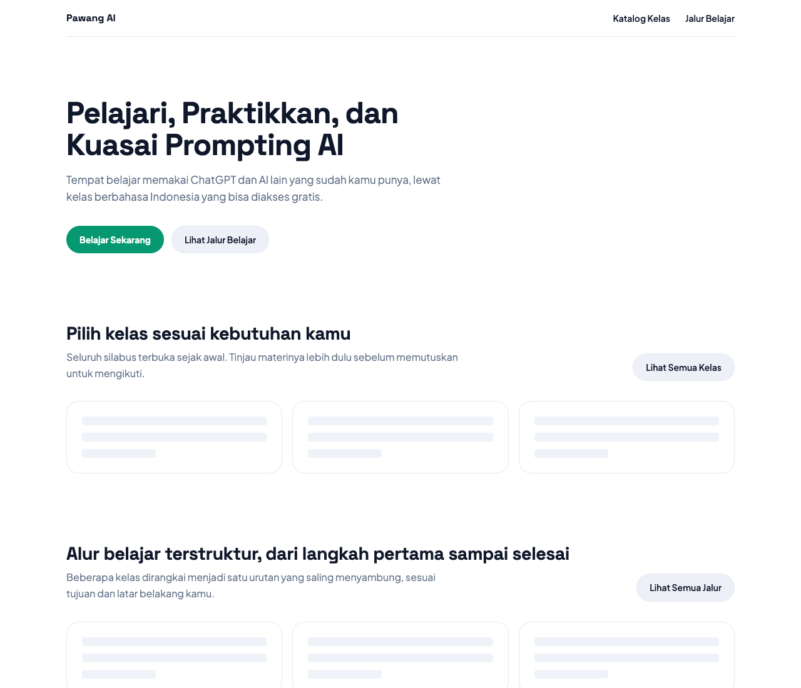
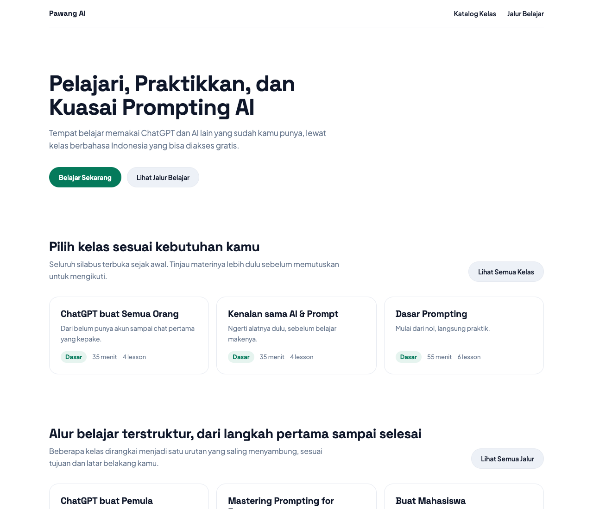

# pawang-home-links

One finding from an audit of [pawang.io](https://pawang.io/) (23 September 2026), reproduced and fixed in a small Nuxt 4 app.

**Finding 2 of the audit:** the homepage's main buttons ("Belajar Sekarang", "Lihat Semua Kelas", "Lihat Semua Jalur") are `<button>` elements that navigate through JavaScript. The course and track lists on the homepage are fetched on the client after mount, so the server HTML contains only grey skeleton boxes.

**Why it matters:**

- On a slow connection the buttons do nothing until the JavaScript bundle (about 300 KB compressed on the real site) has loaded and run.
- The buttons cannot be opened in a new tab, middle-clicked, or copied as a link.
- Crawlers see no link from the homepage to `/courses` or `/tracks`, and no course names in the homepage HTML.

`main` reproduces the pattern found on pawang.io. The fix lives in [pull request #1](https://github.com/jamesvincentsiauw/pawang-home-links/pull/1) so the diff is easy to read.

## The fix

| | Before (`main`) | After (PR) |
| --- | --- | --- |
| CTA markup | `<button type="button">` + `navigateTo()` | `<a href="/courses">` through `NuxtLink` |
| Catalog on the homepage | `onMounted` + `$fetch`, skeleton in server HTML | `useFetch` awaited on the server, cards in server HTML |
| Course and track links in server HTML | 0 | 7 |
| Homepage TTFB (local, 300 ms simulated database) | 9 ms | 311 ms |

The server now waits for the catalog before responding, so the first byte arrives later. What the visitor gets in that first byte is the complete page instead of placeholders, and the page works without any JavaScript.

Server HTML with JavaScript disabled, before and after:

| Before | After |
| --- | --- |
|  |  |

## Run

```sh
pnpm install
pnpm dev
```

Then open http://localhost:3000.

## Verify

```sh
pnpm test
```

The tests fetch the server-rendered homepage and assert that the CTAs are links with real destinations and that course and track names are present. They fail on `main` and pass on the fix branch.

By hand, with the dev server running:

```sh
# CTA markup
curl -s http://localhost:3000/ | grep -oE '<(a|button)[^>]*>[^<]*Belajar Sekarang'

# Course links in the server HTML
curl -s http://localhost:3000/ | grep -c 'href="/courses/'
```

In the browser: right-click "Belajar Sekarang". On `main` there is no "Open link in new tab"; on the fix branch there is.

## What is and is not in scope

Only audit finding 2. The catalog data in `server/data/catalog.ts` is copied from the public listing on pawang.io. Colors, fonts, and radii follow the site's design tokens. Everything else (routing, styling, the API) is a simplified stand-in for the real site, not a copy of it.
